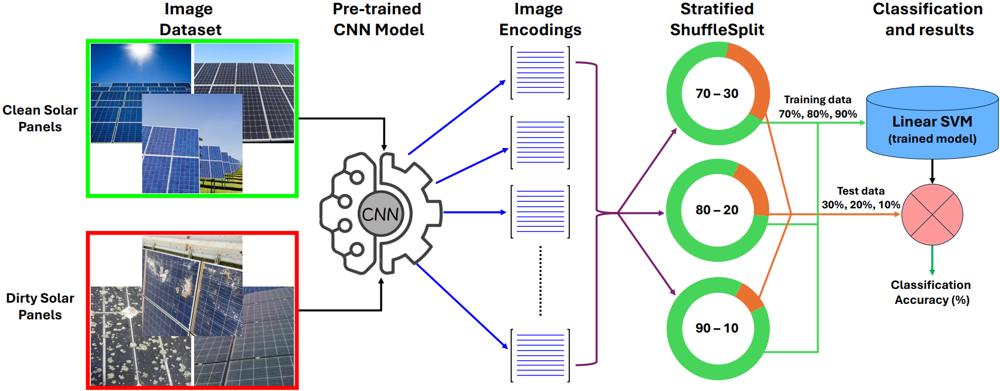

# SolClean: Advancing Backbone Architecture Search for Data-Driven Deep Learning in Sustainable Solar Panel Maintenance via Image-Based Dust Detection

<p align="center">
  
</p>

A compact pipeline to:
1) **Encode** images using a curated list of pre-trained backbones from **timm** (with `alexnet` from torchvision only), and  
2) **Classify** those encodings using a **linear SVM** with repeated stratified cross-validation.

Everything is driven through a single **`config.yaml`** and a one-shot **`main.py`**.

---

## ✨ Features

- **Backbones**: Large curated list from `timm`, plus `alexnet` from torchvision.
- **Per-model preprocessing**: Auto-uses the correct image size/normalization via timm’s data config.
- **Robust encoding**: Resumes from temp batches on interruption; saves final `encoded_images.npy` + `labels.npy`.
- **Evaluation**: Linear SVM with `RepeatedStratifiedKFold`, reporting Accuracy, Top-1/3/5, Precision, Recall, F1.
- **Artifacts**: Optional saving of final `StandardScaler+SVM` per model (`.joblib`) and class order (`_classes.npy`).
- **Config-first**: Paths, batch sizes, model list, and reproducibility settings in `config.yaml`.

---

## 📁 Repository Layout

```
.
├── asset/ # images for README
│   └── block.png
├── classify.py # Linear SVM CV and (optional) final model saving
├── config.yaml # Paths, runtime, and model list
├── encode.py # Feature extraction (timm + torchvision alexnet)
├── main.py # Single entrypoint to run encode → classify
└── README.md # This file

```

> **Main Dataset (Google Drive):** https://drive.google.com/file/d/1b8rcGBcd71clYMl15y_c5Txwlsvpzyv8/view?usp=sharing
> 
> After download, extract as:
>
> ```
> Dataset/
>   ├── class_A/
>   │   ├── img1.jpg
>   │   └── ...
>   └── class_B/
>       ├── img2.jpg
>       └── ...
> ```
> Update `dataset_dir` in `config.yaml` accordingly.

> **Unseen Test Dataset (Google Drive):** https://drive.google.com/file/d/1H4Drx8kcuHe9DEMnk_rpGDjuogKOTfjW/view?usp=sharing
---

## 🔧 Requirements

- Python 3.9+  
- GPU optional (CUDA if available)

Install deps:

```bash
pip install -r requirements.txt
```

**requirements.txt**
```
torch
torchvision
timm
numpy
pandas
scikit-learn
tqdm
Pillow
PyYAML
joblib
openpyxl
```

---

## ⚙️ Configuration (`config.yaml`)

```yaml
# === Paths ===
dataset_dir: "Dataset"            # where your dataset lives
encodings_dir: "encodings1"       # where to write encoded features
results_dir: "results"            # where to write metrics and saved SVMs

# === Runtime ===
batch_size: 32
num_workers: 2
random_state: 42
save_final_models: true           # save {model}_svm.joblib and _classes.npy

# === Models ===
models:
  - convnext_xxlarge
  - resnetv2_152
  - regnet_y_32gf
  - convnext_xlarge
  - densenet161
  - densenet169
  - densenet201
  - convnextv2_tiny
  - dpn131
  - resnet152
  - inception_next_tiny
  - convnextv2_nano
  - inception_next_small
  - convnext_base
  - dpn98
  - inception_next_base
  - dpn107
  - mnasnet0_75
  - convnext_large
  - mnasnet1_0
  - regnet_x_3_2gf
  - efficientnet_b2
  - convnext_small
  - efficientnet_b0
  - efficientnet_b1
  - dpn68
  - alexnet
  - regnet_x_800mf
  - efficientnet_b3
  - efficientnet_b4
  - convnext_tiny
  - cs3darknet_x
  - efficientnet_v2_s
  - regnet_x_1_6gf
  - mobilenet_v3_large
  - vgg16_bn
  - shufflenet_v2_x1_0
  - shufflenet_v2_x2_0
  - mnasnet1_3
  - dpn92
  - mobilenetv4_conv_small
  - densenet121
  - mobilenet_v3_small
  - mnasnet0_5
  - efficientnet_b5
  - efficientnet_b7
  - shufflenet_v2_x0_5
  - regnet_x_400mf
  - dpn68b
  - vgg11_bn
  - vgg13_bn
  - mobilenet_v2
  - vgg11
  - regnet_y_16gf
  - shufflenet_v2_x1_5
  - convnextv2_pico
  - densenetblur121d
  - resnet34
  - resnetv2_50
  - regnet_y_8gf
  - resnet18
  - cs3darknet_focus_l
  - convnext_pico
  - cs3darknet_focus_m
  - inception_v3
  - regnet_y_800mf
  - vgg13
  - convnext_nano
  - vgg16
  - resnet50
  - regnet_y_400mf
  - convnextv2_huge
  - efficientnet_b6
  - vgg19_bn
  - googlenet
  - resnetv2_101
  - efficientnet_v2_m
  - convnextv2_base
  - convnextv2_large
  - regnet_y_3_2gf
  - vgg19
  - resnet101
  - wide_resnet101_2
  - regnet_y_1_6gf
  - xception65
  - resnext101_32x8d
  - resnext50_32x4d
  - regnet_x_32gf
  - convnextv2_atto
  - wide_resnet50_2
  - regnet_x_16gf
  - convnextv2_femto
  - regnet_x_8gf
  - inception_v4
  - mobilenetv4_conv_medium
  - mobilenetv4_conv_large
  - efficientnet_v2_l
  - xception71
  - xception41
```

---

## ▶️ Usage

### 1) End-to-end (encode → classify)
```bash
python main.py --config config.yaml
```

### 2) Encode only
```bash
python main.py --config config.yaml --encode-only
```

### 3) Classify only
```bash
python main.py --config config.yaml --classify-only
```

---

## 📦 Outputs

- **Encodings** (per model):
  ```
  encodings1/
    └── <model_name>/
        ├── encoded_images.npy
        └── labels.npy
  ```

- **Results**:
  ```
  results/
    ├── svm_classification_results.xlsx       # metrics table
    ├── <model_name>_svm.joblib               # (if save_final_models=true)
    └── <model_name>_classes.npy              # class order used by the SVM
  ```

---

## 🧰 Troubleshooting

- **OOM / VRAM errors**: Lower `batch_size` in `config.yaml`.
- **CPU workers**: Tune `num_workers` (2–8 typical). On Windows, stick to small values.
- **Model not found**: Ensure `timm` is installed and the exact model name is spelled correctly.

---

## ⚡ Performance Tips

- Use a GPU if available; `torch.cuda.is_available()` is auto-detected.
- Keep `pin_memory=True` when CUDA is on (already handled).
- Run fewer/lighter models first to validate the pipeline.

---

## 🧪 Reproducibility

- The SVM CV uses `random_state` from `config.yaml`.
- Encodings are deterministic for pretrained inference.


